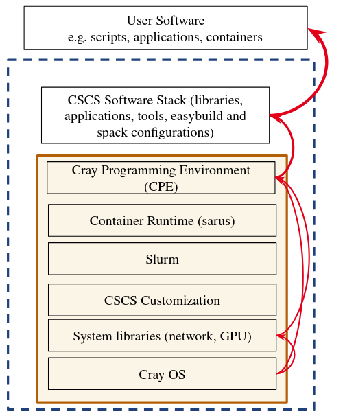
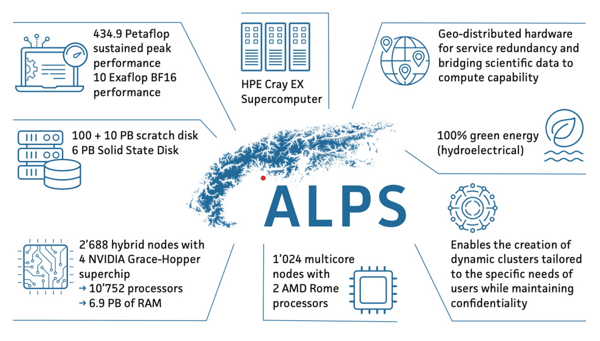

# uenv on Alps
<br>

Ben Cumming

CSCS Webinar 2025

---

I have been at CSCS for 12 years -- the first 8 years as an RSE and benchmarker

<div style="float: right; width: 25%; margin-right: 1em;">
  
</div>

* in practice a glorified user (no root)
* my favourite complaints included:
    * why do people think Python is easy?
    * why can't we have up-to-date software on HPC systems?

CSCS had a reorg -- the folk responsible for deploying software wanted to try something new...
* it was time to try providing up-to-date software.

---
layout: two-cols
layoutClass: gap-2
---

# Software@CSCS pre-Alps

User-facing software was built on top of vendor-provided software stack:
* the Cray Programming Environment (CPE) installed in the base OS image;
* CSCS built additional libraries and applications on top, and installed on a shared file system;
* users built their software and workflows on top;
* ... this is how every CUG site deploys software.

We were reluctant to modify CPE:
* installing a new version or modifying an existing installation required root, and a reboot;
* it wasn't clear whether we could expect support if we heavily modified the stack.

::right::

<div class="flex justify-center">
    
</div>

Upgrading CPE implied rebuilding CSCS-provided and user-installed software
* CPE is released every 6 months
* A breaking change for all parties

---

# Why was this difficult?

The staff who installed the CSCS software and supported users could not modify CPE:
* they were _glorified users_

Updating the system software was very disruptive
* rolling back was also impractical
* so we didn't do it very often

The vendor is conservative -- e.g. the latest release of CPE uses old versions CUDA
* by the time we had them installed they were very out of date

CSCS was a leader in developing CI/CD for building the software stack and building the ReFrame regression testing framework for HPC
* but these alone can't address the underlying problem

---

# Case study: C2SM

The Center for Climate Systems Modeling (C2SM) at ETHZ are long-time collaborators and users:
* Their main case: climate simulation using COSMO then ICON
* Complicated Fortran codes that are very sensitive to dependencies

The proccess for upgrading the systems looked like:
```
do {
    (root) install / configure a new version of CPE on a TDS system
    (user) CSCS update recipes for our software stack and build on a shared file system
    (user) C2SM access the system to build and test their software
} while (there are problems);
update Daint
```

**Upgrades were delayed or cancelled due to unresolved issues:**
* everybody upgrades, or nobody upgrades;
* every upgrade has knock on effects for every user.

---
layout: two-cols
layoutClass: gap-2
---

# The winds of change: Alps

Alps is a HPE Cray EX system with ~4000 nodes.

* Use-case and tennent-specific clusters;
* Aim to have communities take responsibility for software, documentation and support.

We needed to rethink deployment of software, because these don't scale:
* Getting a system administrator to build a new image and reboot a cluster;
* Building a monolithic software stack on top of another monolithic vendored stack.

::right::

<br>

<div class="flex justify-center">
    
</div>

<br>
<br>

<div class="flex justify-center">
    
</div>

---

# Axioms

1. HPC Centers provide pre-built software for their users.

1. Vendors are not capable of delivering stable, up to date, software that meets all our users' needs.

1. Once a scientific project has set up their workflow, it should continue working for the project's 1-3 year duration.

1. Developers and some communities like ML/AI users update continuously to the latest versions of software.

1. Staff who install software and help users need to have full control over the whole software stack.

1. Software installation can't require changes to the running system, or interrupt users.

---
layout: two-cols
layoutClass: gap-2
---

# Part 1: independent stacks

We created [Stackinator](https://eth-cscs.github.io/stackinator/) for building software stacks:
* Each software stack is a yaml _recipe_;
* Clusters are described in yaml files;
* `Stackinator(recipe, cluster) -> Makefile`;
* The Makefile generates a **squashfs file** of the complete software stack;
* Minimal dependencies on the base OS (libfabric).

Uses Spack and packages with Alps-specific optimizations:
* The version of Spack is per recipe;
* Repackaged vendored software, e.g. `cray-mpich`.

::right::

```yaml
icon:
  compiler:
      - toolchain: gcc
        spec: gcc
      - toolchain: llvm
        spec: nvhpc
  mpi:
      spec: cray-mpich@8.1.30%nvhpc
      gpu: cuda
  unify: true
  specs:
  - boost ~mpi
  - python@3.10
  - cuda@12.6
  - eccodes@2.36.4%nvhpc +tools +fortran +aec +openmp jp2k=jasper
  - cosmo-eccodes-definitions@2.36.0.3
  - hdf5%nvhpc +szip +hl +fortran +mpi
  - netcdf-c@4.9.2%nvhpc
  - netcdf-cxx4@4.3.1%nvhpc
  - netcdf-fortran@4.6.1%nvhpc
  - openblas
  variants:
  - +mpi
  - +cuda
  - cuda_arch=90
```

---
layout: two-cols
layoutClass: gap-2
---

# Part 2: using stacks

We developed `uenv` -- "the lightest container runtime possible" that allows users to:
* mount the squashfs image at `/user-environment`;
* set views = environment variable sets;
    * __module view__ provide modules
    * __spack view__ spack integration
    * __app views__ bespoke environments
* manage uenv images in a local repository.

Users see a path populated with their software and a change in environment variables

**Simple is implemented quickly, just works, and just keeps working.**

::right::

```console
$ uenv image ls -ahl
uenv                             arch   system  id                size(MB)  date
gromacs/2024:v1                  gh200  daint   b58e6406810279d5   3,658    2024-09-12
julia/24.9:v1                    gh200  daint   7a4269abfdadc046   3,939    2024-11-09
jupyterlab/v4.1.8:v1             gh200  daint   e23aa859dd398637     453    2025-01-10
linalg/24.11:v1                  gh200  daint   e1640cf6aafdca01   4,461    2024-12-03
linaro-forge/23.1.2:v1           gh200  daint   fd67b726a90318d6     341    2024-08-26
namd/3.0:v3                      gh200  daint   49bc65c6905eb5da   4,028    2024-12-12
netcdf-tools/2024:v1             gh200  daint   2a799e99a12b7c13   1,260    2024-09-04
prgenv-gnu/24.11:v1              gh200  daint   b81fd6ba25e88782   4,191    2024-11-27
prgenv-nvfortran/24.11:v2        gh200  daint   d2afc254383cef20   8,703    2025-01-30
pytorch/v2.6.0:1716539422        gh200  daint   1c5e00f7556ad65d   8,124    2025-03-14
specfem3d/4.1.0:1707945673       gh200  daint   c9ad88d01a48a263   3,672    2025-03-10
$ uenv start prgenv-gnu --view=default
$ which nvcc
/user-environment/env/default/bin/nvcc
$ mpicc --version
gcc (Spack GCC) 13.3.0
$ mount | grep /user-environment
$SCRATCH/.uenv-images/images/b8...ac5/store.squashfs
on /user-environment type squashfs
(ro,nosuid,nodev,relatime,errors=continue)
```

---
layout: two-cols
layoutClass: gap-2
---

# uenv slurm plugin

Slurm integration is a must have:
* convenient for users;
* minimise resource consumption -- only mount the squashfs image once per node;
* improved logging -- keep track of who uses which uenv and how much.

We followed the "principle of least surprise" when deciding on default behavior:
* what do users expect coming from a "modules-based" environment?
* most users don't understand the different between login and compute nodes.

::right::

Slurm mounts squashfs and configures the environment on the compute nodes using flags:
```console
$ srun --uenv=gromacs/2024 --view=plumed -n4 -N1 gmx_mpi ...
```

`srun` inherits the login environment by default:
```console
$ uenv start gromacs/2024 --view=plumed
$ srun -n4 -N1 gmx_mpi ...
```

`sbatch` and `srun` work together:
```console
#!/bin/bash
#SBATCH num-tasks=4
#SBATCH num-nodes=1
#SBATCH uenv=gromacs/2024
#SBATCH view=plumed

srun gmx_mpi ...
# the defaults can be overloaded
srun --uenv=prgenv-gnu/24.11 --view=default ./post-process
```

---

# Interlude: CI/CD for users


<div class="flex justify-center">
    
</div>

---
layout: two-cols
layoutClass: gap-2
---

# Part 3: deploying stacks

All uenv image recipes are maintained on [GitHub](https://github.com/eth-cscs/alps-uenv).

The CI/CD external service runs the build and deployment pipeline

* a pull request is opened for a recipe update
* a build job builds the uenv on the target cluster
* ORAS pushes the squashfs artifact to a container registry
* a test job pulls and runs ReFrame tests

Further manual testing can be performed (including by target users)

The image is deployed with a shallow copy.

::right::

Deployment is performed using the `uenv` CLI
```
$ uenv image copy build::vasp/v6.5.0:1631426005@daint%gh200 \
                  deploy::vasp/v6.5.0:v1@daint%gh200
$ uenv image find vasp
uenv            arch   system  id                size(MB)  date
vasp/v6.4.3:v1  gh200  daint   86edce79074e3478   7,963    2024-08-26
vasp/v6.4.3:v2  gh200  daint   d4753368f8b2baca   7,954    2025-01-24
vasp/v6.5.0:v1  gh200  daint   b7b097cb03d36451   5,709    2025-01-24
```

VASP is restricted: pull with a token:
```
$ uenv image  pull --token=$HOME/.ssh/jfrog-token \
                vasp/v6.5.0:v1
pulling b7b097cb03d36451 100.00% ━━━━━━━━━━━ 5709/5709
updating vasp/v6.5.0:v1@daint%gh200
```

And use:
```
$ uenv start vasp/v6.5.0:v1 --view=vasp
$ srun -n64 -N16 --gpus-per-task=1 vasp_gam ...
```

---

# Axioms revisited

1. ✅ HPC Centers provide pre-built software for their users.
1. Vendors are not capable of delivering stable, up to date, software that meets all our users' needs.
1. ✅ Scientific projects have 1-3 year duration - once installed it should work for the project duration.
    * over the last 2 years uenv have not broken due to system changes.
    * with breaking changes, we can rebuild images.
1. ✅ Developers and some communities like ML/AI users update frequently to the latest versions of software
    * uenv and containers can be built and used as soon as new versions of cuda, MPI, etc. are available
    * there are some limits imposed by kernel and driver versions available to us.
1. ✅ Staff who install software and help users need to have full control over the whole software stack.
    * staff can build software by hand, or through pipelines.
1. ✅ Software installation can't require changes to the running system, or interrupt users.
    * uenv and container deployment are deployed to a container registry.

---

# The Climate and Weather Platform

The Climate and Weather Platform is part of the Alps research infrastructure:
* "Santis": a GH200 based vCluster on Alps operated by CSCS.
* the main partners are **C2SM**, Exclaim and MeteoSchweiz (MCH).

Initially I provided the software environments:
* An `icon` environment for building and running ICON on Santis;
* `mch` environments for MCH production (on MCH systems);
* environments for R&D and analysis.

C2SM and MCH _enthusiastically_ created a pipeline for deploying uenv:
* C2SM and MCH software stacks are no longer under sole management by CSCS;
* C2SM are actively creating and updating [recipes](https://github.com/C2SM/software-stack-recipes/pull/6).

Smaller communities and individual users are also building and sharing uenv.

---

# Retrospective

By empowering our glorified users, i.e. staff who don't have root, we empowered our users.

* empowering is both responsibility and useable tools and processes

We have started achieving a key objective of Alps as research infrastructure:

* User communities and partners take responsibility for the software environment provided to users on their Alps platforms.

<br>
<br>

__This wasn't part of a clever masterplan - we focussed on end to end responsibility for staff and realised later the possibilities for user communities.__

---

# on documentation...

Our current documentation uses Confluence (don't try this at home):
* only CSCS staff can edit docs;
* unfamiliar and awkward workflows to write, review and deploy docs;
* the docs are not great -- user communities are creating parallel docs in markdown.

CSCS are moving to a GitHub repository with:
* deployment via CI/CD that generates preview docs;
* familiar tools and workflows;
* everybody can also contribute to the documentation infrastructure;
* staff are contributing much more enthusiastically already!

**Open question**: if docs are structured around communities and platforms... will they contribute?

---

<br>
<br>
<br>
<br>
<br>

## Thank you!

<br>
<br>

## Any questions?

