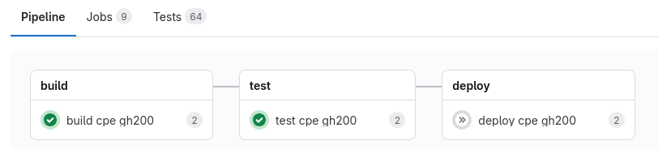

# CPE Containers at CSCS

Ben Cumming and Andras Fink

CUG 2025 PEAD BoF

---

# CSCS only provides CPE in a container

**THE OLD**: install CPE in the base OS image:
* root access needed to build a new image and reboot
* modifying the deployment or deploying a new version is a pain in the neck:
    * **for CSCS**: rebuild, test on a TDS, reboot;
    * **for users**: reboot downtime, then a changed software environment.

**THE NEW** deployment as a container:
* deployment independent of system upgrade/reboot
* non-admin CSCS staff (glorified users) can deploy new images
* roll back and upgrade is trivial

---

# HPE RPM repository

HPE provide an RPM repository with RPMs for CPE packages:
* official releases for 24.7 and 25.3
* pre-releases of selected packages, e.g. `cray-mpich 9.0`

```
https://update1.linux.hpe.com/repo/cpe/<CPE-VER>/base/<OS>/<OS-VER>/<ARCH>
```

Access requires a HPE Passport account and a token
* [cpe.ext.hpe.com/docs/latest/install/token-authed-repo.html](https://cpe.ext.hpe.com/docs/latest/install/token-authed-repo.html)

CSCS create a proxy repository:
* for fast local acces
* to add missing packages

---

# Create a Dockerfile

HPE provides examples of CPE DockerFiles: 

CSCS manages DockerFiles in a GitHub repository [eth-cscs/cpe-containers](https://github.com/eth-cscs/cpe-containers).

* A main [DOCKERFILE](https://github.com/eth-cscs/cpe-containers/blob/main/Dockerfile) is specialised for:
    * CPE version
    * uarch
    * PrgEnv

We provide separate containers for each programming environment
* `cpe-gnu/24.7` and `cpe-gnu/24.7`
* `cpe-gnu/25.3` with `cray-mpich 9` [will be available](https://github.com/eth-cscs/cpe-containers/pull/4) for the tutorial Monday morning.

---

# Build with CI/CD

We use leverage our "CI/CD Container Build Service" for GitHub to build and test CPE containers

* build logs are [available publicly](https://gitlab.com/cscs-ci/ci-testing/webhook-ci/mirrors/2669120559805972/3219555857501655/-/jobs/9450233771)
* ReFrame tests have been adapted to [run in containers](https://gitlab.com/cscs-ci/ci-testing/webhook-ci/mirrors/2669120559805972/3219555857501655/-/jobs/9435146510).
* Containers are stored in a self-hosted Container registry at CSCS.

<br>



---

# Deploy to system

Download and store the images on a shared filesystem and configured for all users on the system.

**EXAMPLE** to start an interactive session
```
srun --environment=cpe-cray/25.3 --pty bash
```

* the scratch filesystem is mounted automatically inside the container;
* users can further customise what to mount and configure.

What about **rollback**?
* upgrades and bug fixes are deployed as a new *tag*
* existing deployments are still available: users choose which version to use at runtime

---

# Wrapping up

Shout out to **Andreas Fink** and **Theofilos Manitaras** at CSCS.

**Talking point**: What is HPE's road map for the repository?
* currently packages are missing.
* it is currently marked as "experimental" and "not for production"

CSCS also uses the RPM repo for uenv deployment
* it is our position that this is a good step towards modern CPE deployment


