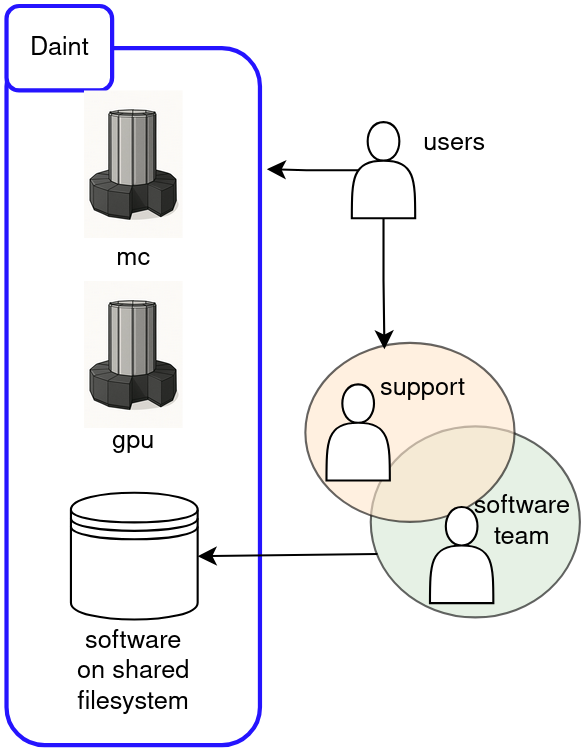
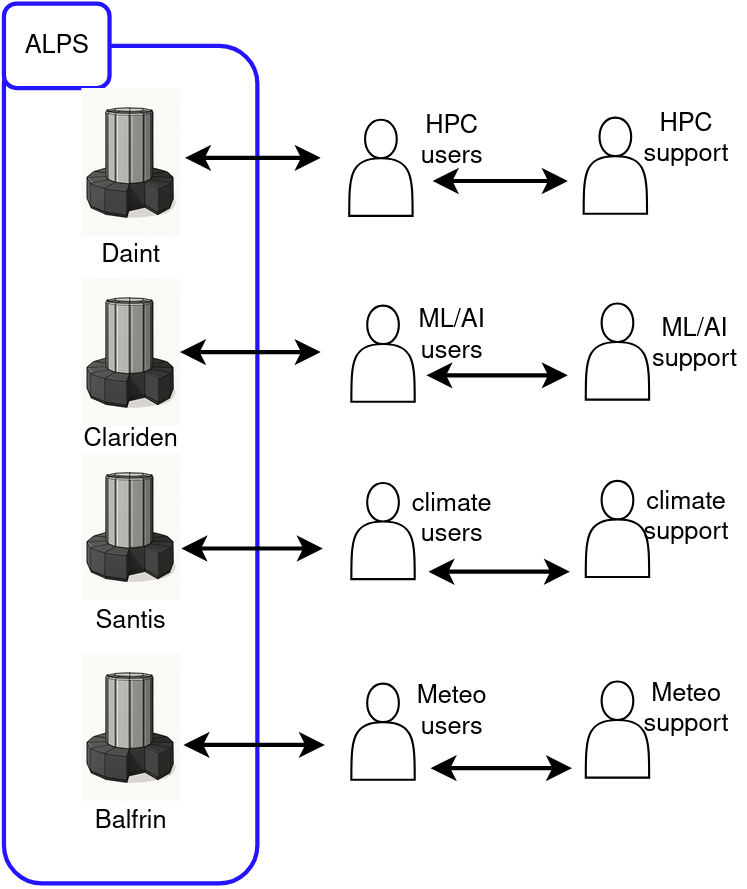
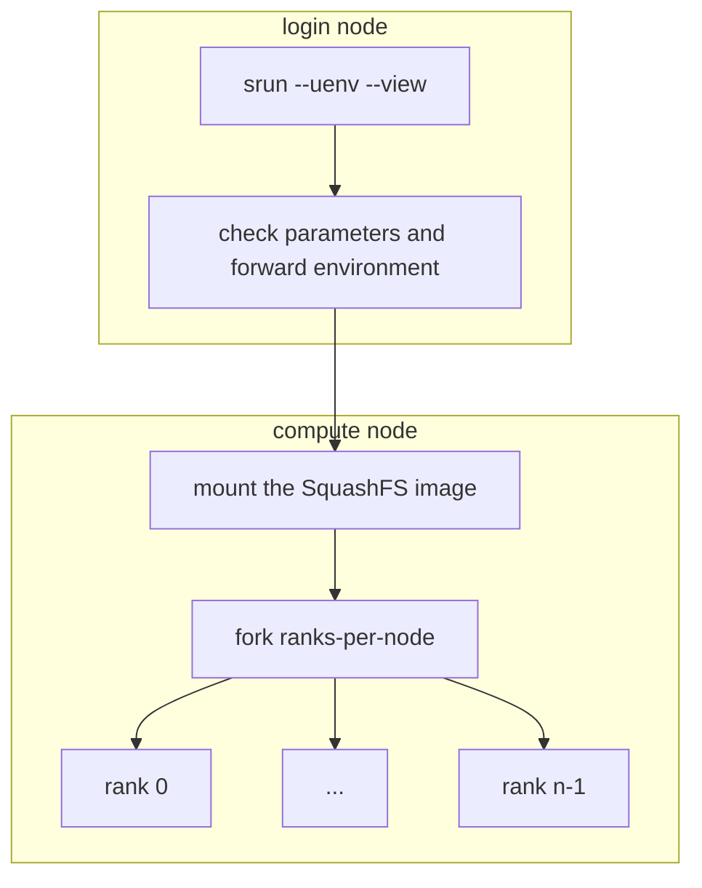
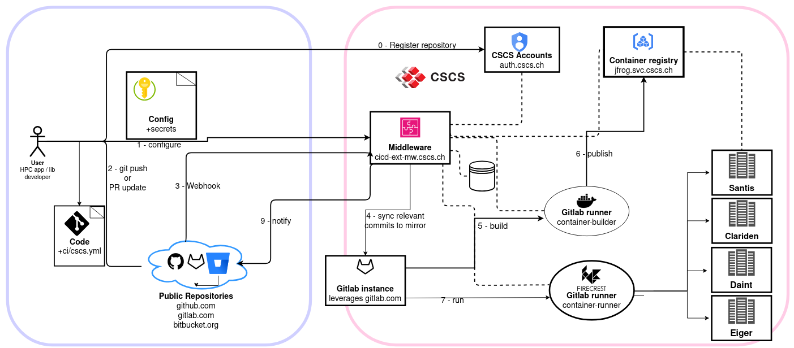

## Modern Software Deployment on a
## Multi-tenant HPE Cray-EX System

Ben Cumming, Andreas Fink, John Biddiscombe and Simon Pintarelli

ETH Zurich - Swiss National Supercomputing Center (CSCS)

CUG 2025

---
layout: two-cols
layoutClass: gap-2
---

# The winds of change: Alps

Alps is a HPE Cray EX system with ~4000 nodes.

* Use-case-specific and tenant-specific clusters;
* **Aim**: communities take responsibility for software, documentation and support.

<br>

<div class="flex justify-center">
    
</div>

<br>

How CSCS provides software had to change.

::right::

<br>
<br>
<br>
<br>
<br>

<div class="flex justify-center">
    
</div>

---
layout: two-cols-header
---

# Multi-tenancy vs. Software Deployment

:: left ::

**Before**: One system with two partitions
<div class="flex justify-center">
    
</div>

:: right ::

**After**: Six (and growing) systems
<div class="flex justify-center">
    
</div>

---

# Alps Software Deployment

<div class="flex justify-center">
    
</div>

<!--

Here is an overview of the workflow for deploying software that we use

We will cover each component in this presentation.

## Components
* sw + runtime
* registry
* pipeline
-->


---
layout: two-cols-header
---

# software = environments + runtime

Centers provide both pre-built software and the means to use it to our users.

::left::

### **software** is built or downloaded.

Scripts + Spack/Easybuild + **modules** on filesystem:
- Pawsey on Setonix
- CSCS on Daint-XC
- E4S using Spack

Download **containers**:
- NVIDIA NGC
- E4S containers

From the **[EESSI](https://www.eessi.io/)** repository

::right::

### A **runtime** serves the software.

install a **modules** implementation:
* TCL modules
* Lmod

<br>

provide a **container** runtime:
* Podman/Apptainer/Sarus
* pyxis+enroot

CernVM-FS for **[EESSI](https://www.eessi.io/docs/filesystem_layer/)**: virtual network file system

---
layout: two-cols
---

# Stackinator

CSCS solution: stackinator

recipe➡️  stackinator➡️  Makefile➡️  Spack➡️  squashfs

* cray-mpich package from RPMS
* libfabric, cxi, cassini, OpenMPI, aws-ofi-nccl, nccl
* spack versioned per recipe

::right::

```yaml
icon:
  compiler:
      - toolchain: gcc
        spec: gcc
      - toolchain: llvm
        spec: nvhpc
  mpi:
      spec: cray-mpich@8.1.30%nvhpc
      gpu: cuda
  unify: true
  specs:
  - boost ~mpi
  - python@3.10
  - cuda@12.6
  - eccodes@2.36.4%nvhpc +tools +fortran +aec +openmp jp2k=jasper
  - cosmo-eccodes-definitions@2.36.0.3
  - hdf5%nvhpc +szip +hl +fortran +mpi
  - netcdf-fortran@4.6.1%nvhpc
  - openblas
  variants:
  - +mpi
  - +cuda
  - cuda_arch=90
```

---

# uenv runtime

The uenv runtime is the interface for SquashFS images

* command line tool (CLI)
* slurm plugin

C++ with a common library

Installed via RPMs

* oras
* curl
* sqlite3

---

# uenv image management

<div class="flex justify-center">
    
</div>

The **registry** is a _container registry_ with all of the uenv provided by CSCS.
* `uenv image find` will list available images: e.g. `uenv image find namd@eiger`

A **repository** is a filesystem folder with uenv that have been downloaded:
* `uenv image ls` will list pulled images: e.g. `uenv image ls pytorch`

<br>

---
layout: two-cols-header
---

# using uenv on the command line

The uenv command line tool (CLI)

::left::

### `uenv run`: runs a command

Wraps a call with a uenv environment:
* returns after the command has run
* later calls are not affected by earlier calls
* **isolation** of environments

```bash
# use a text editor provided by a uenv
$ uenv run --view=ed editors -- nvim
# use the python REPL
$ uenv run --view=default prgenv-gnu/24.11:v2 -- python
# use a graphical application
$ uenv run --view=default netcdf-tools/2024 -- \
  ncview sst_nmc_daSilva_anoms.66-03.DJF.nc
```

**For use in scripts**

::right::

### `uenv start`: starts a shell

The following are eqivalent:
```bash
uenv run   prgenv-gnu/24.11:v2 --view=default -- bash
uenv start prgenv-gnu/24.11:v2 --view=default
```

Useful for compilation and development:

```bash
# start the session
$ uenv start prgenv-gnu/24.11:v2 --view=default
# do work in the sesssion
$ CC=mpicc CXX=mpic++ cmake ..
# end the session
$ exit
```

**For interactive use only**

---

# uenv views apply environment variable patches

The `modules` and `spack` views are generated automatically:
* `modules` provides [modules of packages](https://eth-cscs.github.io/cscs-docs/software/uenv/#modules);
* `spack` sets [environment variables that help Spack users](https://eth-cscs.github.io/cscs-docs/build-install/uenv/#building-software-using-spack).

Other recipe-specific views create a path with the following structure:
```
/user-environment/env/<view-name>
├── lib
├── lib64
├── bin
├── include
...
└── share
```

Symlinks link to the software in the view to the location where it was installed, and environment variables refer to the view path, e.g. `PATH=/user-environment/env/default/bin:$PATH`
```bash
$ realpath /user-environment/env/default/bin/cmake
/user-environment/linux-sles15-zen2/gcc-13.3.0/cmake-3.30.5-yfndm72rv7msnctkb2nj6hj6k3pn2yi5/bin/cmake
```

---
layout: two-cols
layoutClass: gap-2
---

# SLURM speaks uenv

On Alps the uenv SLURM plugin configures uenv on the compute nodes of jobs.

Spank plugin implements `--uenv` and `--view` flags:
* **login node**: Check the parameters, find the SquashFS image and set environment variables
    * fail early
* **compute**: mount the SquashFS image before forking the MPI ranks on the node

The SquashFS image is mounted once per node.

::right::



---

# SLURM integration: srun

Use the `--uenv` and `--view` flags with `srun`... the following are equivalent:
```
$ srun -n4 -N1 uenv run prgenv-gnu/24.11 --view=default python3 ./big-job.sh
$ srun -n4 -N1 --uenv=prgenv-gnu/24.11   --view=default python3 ./big-job.sh
```

Using the SLURM plugin is more efficient:
* SquashFS is mounted only once per node;
* and it fails immediately without using resources if there is an invalid parameter.

SLURM detects and uses the calling uenv environment on compute nodes (just like modules)
```
$ uenv start prgenv-gnu/24.11:v2 --view=default
$ srun -n128 -N32 --gpus-per-task=1 python3 ./runner.py
```

---
layout: two-cols-header
---

# Registry: artifact management

**How to manage SquashFs images over multiple clusters (with different storage mounted)?**

::left::

<div class="flex items-center gap-0">
  <h3 class="font-normal">OCI Registry</h3>
  
</div>

We use out existing self-hosted container registry.

Images are stored as follows:

`nspace/cluster/uarch/name/version:tag`

`nspace` ∈ {`build`, `deploy`}

* default anonymous read access
* restrictions with patterns: `*/*/*/vasp/*`
* pipeline and staff have write permission

::right::

<div class="flex items-center gap-0">
  <h3 class="font-normal">ORAS</h3>
  
</div>

Facilitates using OCI registries for storing generic artifacts.

**The pipeline** pushes to the registry:
```console
$ address=jfrog.svc.cscs.ch/uenv/build/
    daint/gh200/prgenv-gnu/24.11:1716820670
$ oras push $address --artifact-type application/x-squashfs
    store.squashfs
$ oras attach $address --artifact-type uenv/meta ./meta
```

**The CLI** queries and pulls from the registry:
```
$ oras discover $address --artifact-type uenv/meta
$ oras pull $address
    --output $repo/images/$hash/store.squashfs
```

---

# Deployment and uenv Management

<div class="flex justify-center">
    
</div>

<!--
## NEEDS
- infrastructure for running pipelines on site
- manage recipes (CSCS staff can create/modify)
- trigger builds (CSCS staff can trigger)
- build (stackinator on target node)
- store in registry
- test (reframe on target cluster)
-->

---

# CSCS CI/CD External service

<div class="flex justify-center">
    
</div>

<!--
CSCS has developed a CI/CD external Service
* aim: GitHub, GitLab and BitBucket projects have well-integrated CI/CD on HPC systems
* users register and configure pipelines
* triggered by webhooks on PRs and merges
* uses GitLab under the hood: specialized F7t runner

## Needs met:
* manage recipes (CSCS staff can create/modify)
* infrastructure for running pipelines on site
* trigger builds (CSCS staff can trigger)

-->

---

# recipe repo

The `ethc-cscs/alps-uenv` repository
- structure
- config

---

# CI/CD project

Screenshot of project page and talk to the following

* permission to push to build namespace for all vClusters
* whitelist CSCS staff
* ci.yaml that configures uenv-specific pipelines

---

# uenv-pipeline

`eth-cscs/uenv-pipeline`

* generate pipeline from template
* runs build (s8r) and test (ReFrame)

---

# ReFrame testing

* show `refame.yaml` and talk to how it works

---

# Deployment

Manual copy from build to deploy namespace

* `uenv image find build::cp2k`
* `uenv image pull build::cp2k`
* `uenv image copy build::cp2k deploy::cp2k`
* `uenv image find cp2k`

---

# Building blocks for community engagement

<div class="flex justify-center">
    
</div>


<!--
The *Center for Climat Systems Modeling* (C2SM) used Daint
- C2SM are a user, and support a large community using ICON
- C2SM developed their own Spack based workflow for building ICON
- CSCS provides stack = MPI, compiler, CUDA, HDF5, netcdf, ...
- **before**: slow iteration speed on a TDS to test and tweak, and we would not upgrade until they were happy because the same env provided to all users

CSCS hosts MCH on Alps:
- production sofwtare stack provided by CSCS

**AIM** How can C2SM become more resiliant, and take control of providing support?
**AIM** How can MCH take more control of their pro
-->

---

# Reflection

* work expands to fill capacity: pipelines mean we deploy more software
* community provides more software
    * acceptance of new approach (uenv) was easier than I feared
* empowering staff empowers users

---

# Future work

* Spack 1.0
* xxx

All tools, workflows, etc are in public GitHub repositories
- varying levels of site-specificity


---

# Questions

Grab a coffee and chat with us outside


---

<div class="flex items-center gap-0">
  <h1 class="font-normal">Climate and Weather Community</h1>
  
  
</div>

The *Center for Climat Systems Modeling* (C2SM) used Daint
- C2SM are a user, and support a large community using ICON
- C2SM developed their own Spack based workflow for building ICON
- CSCS provides stack = MPI, compiler, CUDA, HDF5, netcdf, ...
- **before**: slow iteration speed on a TDS to test and tweak, and we would not upgrade until they were happy because the same env provided to all users

CSCS hosts MCH on Alps:
- production sofwtare stack provided by CSCS

**AIM** How can C2SM become more resiliant, and take control of providing support?
**AIM** How can MCH take more control of their pro

---

# uenv build service

These components can be mixed and matched

`uenv build recipe target`

deploys to `service::`

* communities using to build their own
* cscs staff building one-off

---

# uenv use cases

* mch
* jupyter

