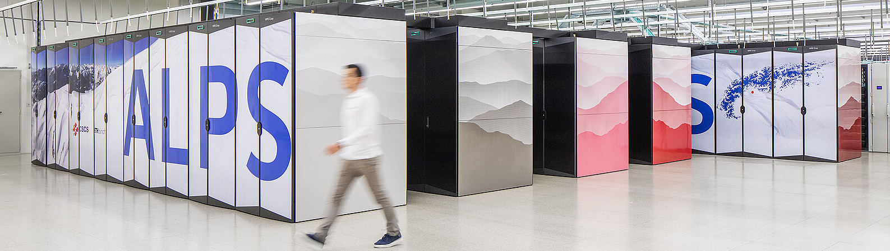
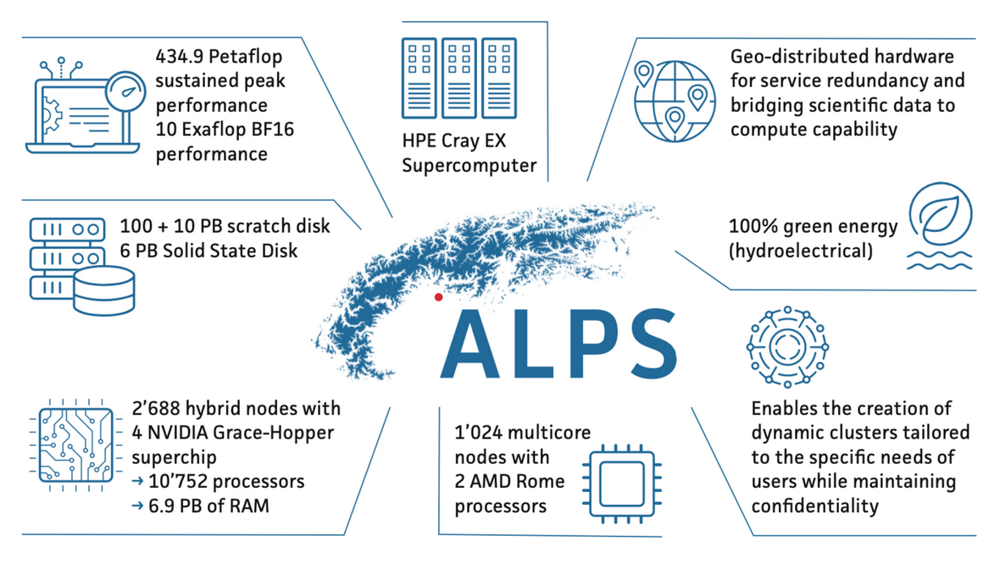
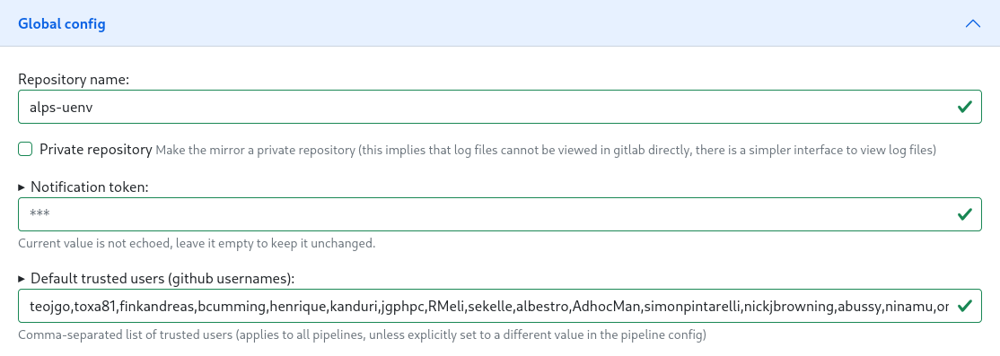
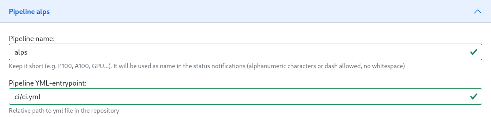
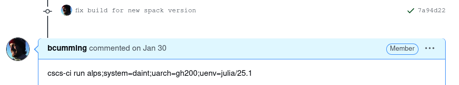

## Modern Software Deployment on a
## Multi-tenant HPE Cray-EX System

Ben Cumming, Andreas Fink, John Biddiscombe and Simon Pintarelli

ETH Zurich - Swiss National Supercomputing Center (CSCS)

CUG 2025

---
layout: two-cols
layoutClass: gap-2
---

# The winds of change: Alps

Alps is a HPE Cray EX system with ~4000 nodes.

* Use-case-specific and tenant-specific clusters;
* **Aim**: communities take responsibility for software, documentation and support.

<br>

<div class="flex justify-center">
    
</div>

<br>

How CSCS provides software had to change.

::right::

<br>
<br>
<br>
<br>
<br>

<div class="flex justify-center">
    
</div>

---
layout: two-cols-header
---

# Multi-Tenant Software Deployment

:: left ::

**Before**: One system with two partitions
<div class="flex justify-center">
    
</div>

:: right ::

<div v-click>

**After**: Six (and growing) systems
<div class="flex justify-center">
    
</div>

</div>

---

# Alps Software Deployment

<div class="flex justify-center">
    
</div>

<!--
Here is an overview of the workflow for deploying software that we use

We will cover each component in this presentation.

## Components
* sw + runtime
* registry
* pipeline
-->


---
layout: two-cols-header
---

# environments  = software + runtime

## **We provide both pre-built software and the means to use it**

::left::

<div v-click>

### **software** is built or downloaded.

Scripts + Spack/Easybuild + **modules** on filesystem:
- Pawsey on Setonix
- CSCS on Daint-XC
- E4S using Spack

Download **containers**:
- NVIDIA NGC
- E4S containers

From the **[EESSI](https://www.eessi.io/)** repository

</div>

::right::

<div v-click class="text-x1">

### A **runtime** serves the software.

install a **modules** implementation:
* TCL modules
* Lmod

<br>

provide a **container** runtime:
* Podman/Apptainer/Sarus
* pyxis+enroot

CernVM-FS for **[EESSI](https://www.eessi.io/docs/filesystem_layer/)**: virtual network file system

</div>

---
layout: two-cols
---

# Building Software Stacks

[Stackinator](https://eth-cscs.github.io/stackinator/) (CUG 2023) is a configuration tool for isolated software stacks

<div v-click>

```
stackinator(recipe,cluster)➡️ Makefile➡️ Spack➡️ SquashFS
```

* Each software stack is a yaml _recipe_;
* Clusters are described in yaml files;
* Minimal dependencies on the base OS (libfabric).

Uses Spack and packages with SS11 optimizations:
* The Spack version is set in the recipe;
* Repackaged vendored software, e.g. `cray-mpich`.

The SquashFS images are **self-contained** and **independent**

</div>

::right::

<div v-click class="text-x1">

```yaml
gcc-env:
  compiler:
      - toolchain: gcc
        spec: gcc
  mpi:
      spec: cray-mpich@8.1.30
      gpu: cuda
  unify: true
  specs:
  - boost +chrono +filesystem +iostreams +mpi +python
  - fftw
  - gsl
  - netcdf-c
  - openblas threads=openmp
  - python@3.12
  - cuda@12.6
  variants:
  - +mpi
  - +cuda
  - cuda_arch=90
  views:
    default:
      link: roots
      uenv:
        add_compilers: true
        prefix_paths:
          LD_LIBRARY_PATH: [lib, lib64]
```

</div>

<!--

* we skip over this quickly because it has been presented previously.
* we have made improvements and extensions, but nothing radical.

* versioning Spack per-image is important: we don't want a while workflow that depends on a specific version of Spack that then becomes painful to upgrade
-->

---

# uenv runtime

The uenv runtime is a CLI tool and SLURM plugin for mounting SquashFS and configuring the environment.

**Open source:** [github.com/eth-cscs/uenv2](https://github.com/eth-cscs/uenv2)
<br>

<div v-click>

**Why is it called uenv2?**
* The first version was written in Python, then we rewrote it in C++.
* You could also modify the environment with a command similar to `module load`.

</div v-click>

<br>

<div v-click class="text-x1">

**Why did you change?**
* let's take that offline.

<div class="flex justify-center">
    
</div>

</div>

---

# uenv Image Management

<div class="flex justify-center">
    
</div>

<div v-click>

The **registry** is a _container registry_ with all of the uenv provided by CSCS:
* `uenv image find` will list available images: e.g. `uenv image find namd@eiger`

</div>

<div v-click class="text-x1">

A **repository** is a filesystem folder with uenv that have been downloaded:
* `uenv image ls` will list pulled images: e.g. `uenv image ls pytorch`

</div>

<br>

---
layout: two-cols-header
---

# using uenv on the command line

::left::

<div v-click>

### `uenv run`: runs a command

Wraps a call with a uenv environment:
* returns after the command has run
* later calls are not affected by earlier calls
* **isolation** of environments

```bash
# use a text editor provided by a uenv
$ uenv run --view=ed editors -- nvim
# use the python REPL
$ uenv run --view=default prgenv-gnu/24.11:v2 -- python
# use a graphical application
$ uenv run --view=default netcdf-tools/2024 -- \
  ncview sst_nmc_daSilva_anoms.66-03.DJF.nc
```

**For use in scripts**

</div v-click>

::right::

<div v-click class="text-x1">

### `uenv start`: starts a shell

The following are eqivalent:
```bash
uenv run   prgenv-gnu/24.11:v2 --view=default -- bash
uenv start prgenv-gnu/24.11:v2 --view=default
```

Useful for compilation and development:

```bash
# start the session
$ uenv start prgenv-gnu/24.11:v2 --view=default
# do work in the sesssion
$ CC=mpicc CXX=mpic++ cmake ..
# end the session
$ exit
```

**For interactive use only**

</div>

---

# uenv Views Apply Environment Variable Patches

The `modules` and `spack` views are generated automatically:
* `modules` provides [modules of packages](https://eth-cscs.github.io/cscs-docs/software/uenv/#modules);
* `spack` sets [environment variables that help Spack users](https://eth-cscs.github.io/cscs-docs/build-install/uenv/#building-software-using-spack).

Other recipe-specific views create a path with the following structure:
```
/user-environment/env/<view-name>
├── lib
├── lib64
├── bin
├── include
...
└── share
```

Symlinks link to the software in the view to the location where it was installed, and environment variables refer to the view path, e.g. `PATH=/user-environment/env/default/bin:$PATH`
```bash
$ realpath /user-environment/env/default/bin/cmake
/user-environment/linux-sles15-zen2/gcc-13.3.0/cmake-3.30.5-yfndm72rv7msnctkb2nj6hj6k3pn2yi5/bin/cmake
```

---
layout: two-cols
layoutClass: gap-2
---

# SLURM speaks uenv

On Alps the uenv SLURM plugin configures uenv on the compute nodes of jobs.

Spank plugin implements `--uenv` and `--view` flags:
* **login node**: Check the parameters, find the SquashFS image and set environment variables
    * fail early
* **compute**: mount the SquashFS image before forking the MPI ranks: the SquashFS mounted once per node.

```console
$ srun -n4 -N1 --uenv=prgenv-gnu/24.11:v2  --view=default
    python3 ./job.py
# compute nodes inherit login env: this is equivalent
$ uenv start prgenv-gnu/24.11:v2 --view=default
$ srun -n4 -N1 python3 ./job.py
```

::right::


---
layout: two-cols-header
---

# Registry: artifact management

**How to provide SquashFs images over multiple clusters (with different storage mounted)?**

::left::

<div v-click>

<div class="flex items-center gap-0">
  <h3 class="font-normal">OCI Registry</h3>
  
</div>

We use out existing self-hosted container registry.

Images are stored as follows:

`nspace/cluster/uarch/name/version:tag`

`nspace` ∈ {`build`, `deploy`}

* default anonymous read access
* restrictions with patterns: `*/*/*/vasp/*`
* pipeline and staff have write permission

</div>

::right::

<div v-click class="text-x1">

<div class="flex items-center gap-0">
  <h3 class="font-normal">ORAS</h3>
  
</div>

Facilitates using OCI registries for storing generic artifacts.

**The pipeline** pushes to the registry:
```console
$ address=jfrog.svc.cscs.ch/uenv/build/
    daint/gh200/prgenv-gnu/24.11:1716820670
$ oras push $address --artifact-type application/x-squashfs
    store.squashfs
$ oras attach $address --artifact-type uenv/meta ./meta
```

**The CLI** queries and pulls from the registry:
```
$ oras discover $address --artifact-type uenv/meta
$ oras pull $address
    --output $repo/images/$hash/store.squashfs
```
</div>

---

# Deployment and uenv Management

<div class="flex justify-center">
    
</div>

<!--
## NEEDS
- infrastructure for running pipelines on site
- manage recipes (CSCS staff can create/modify)
- trigger builds (CSCS staff can trigger)
- build (stackinator on target node)
- store in registry
- test (reframe on target cluster)
-->

---

# CSCS CI/CD External service

<div class="flex justify-center">
    
</div>

<!--
CSCS has developed a CI/CD external Service
* aim: GitHub, GitLab and BitBucket projects have well-integrated CI/CD on HPC systems
* users register and configure pipelines
* triggered by webhooks on PRs and merges
* uses GitLab under the hood: specialized F7t runner

## Needs met:
* manage recipes (CSCS staff can create/modify)
* infrastructure for running pipelines on site
* trigger builds (CSCS staff can trigger)

t-->

---

# Recipe repo and CI/CD Project

<div class="flex justify-center">
    
</div>

<br>

<div class="flex justify-center">
    
</div>

---
layout: two-cols-header
---

# uenv-pipeline

::left::

The pipeline is maintained in a
GitHub repository: [`eth-cscs/uenv-pipeline`](https://github.com/eth-cscs/uenv-pipeline)

* generate pipeline from template
* build and test phase implementation
* image management

::right::

Used by multiple services:
* `uenv build` command
* CI/CD external "uenv service"
* community-maintained repositories (more later)

::bottom::

<br>
<br>
<br>

<div class="flex justify-center">
Triggered by comments on GitHub PRs.
</div>

<div class="flex justify-center">
    
</div>


---
layout: two-cols-header
---

# ReFrame Testing

### **uenv need to be tested when they are built and daily to check for regressions.**

::left::

ReFrame tests configured in the recipe:
* environments that exhibit testable *features*
* how to configure each environment

**If present the pipeline runs the tests.**

**Nightly testing:**
* `uenv find` to list all uenv on the system
* `uenv pull --only-meta`: check meta data
* run reframe tests

**The reframe tests are described in a central repository**

::right::

<div v-click>

For example, the [NAMD](https://github.com/eth-cscs/alps-uenv/blob/main/recipes/namd/3.0/gh200/extra/reframe.yaml) configuration:

```yaml
develop:
  features:
    - cuda
    - namd-single-node-dev
  views:
    - develop-single-node
run:
  features:
    - cuda
    - namd-single-node
  views:
    - namd-single-node
```

Provides two environments:
1. `develop` everything needed to build NAMD
1. `run` provides pre-built NAMD

</div>

---

# Building blocks for community engagement

<div class="flex justify-center">
    
</div>


<!--
The *Center for Climat Systems Modeling* (C2SM) used Daint
- C2SM are a user, and support a large community using ICON
- C2SM developed their own Spack based workflow for building ICON
- CSCS provides stack = MPI, compiler, CUDA, HDF5, netcdf, ...
- **before**: slow iteration speed on a TDS to test and tweak, and we would not upgrade until they were happy because the same env provided to all users

CSCS hosts MCH on Alps:
- production sofwtare stack provided by CSCS

**AIM** How can C2SM become more resiliant, and take control of providing support?
**AIM** How can MCH take more control of their pro
-->

---

# Is it Worth It?

** The good **

* Has it reduced workload?
    * Total effort has not decreased. Deployed software has increased significantly.
* Empowering staff empowers users:
    * Communities are providing complete software stacks software (e.g. C2SM)
    * Users accepted uenv with little fuss (I was surprised)
* Over two years old software stacks are still working.

** The bad **

* The `(cluster-config X Spack X stackinator)` matrix requires careful management
* Development of Stackinator and uenv had a high up-front cost
    * (approx 1 person full time for 2 years)

---

# Future work

* Spack 1.0
* xxx

All tools, workflows, etc are in public GitHub repositories
- varying levels of site-specificity


---

# Questions

<br>

Ask now if we have time

<br>

or...

<br>

Grab a coffee and chat outside later


---

<div class="flex items-center gap-0">
  <h1 class="font-normal">Climate and Weather Community</h1>
  
  
</div>

The *Center for Climat Systems Modeling* (C2SM) used Daint
- C2SM are a user, and support a large community using ICON
- C2SM developed their own Spack based workflow for building ICON
- CSCS provides stack = MPI, compiler, CUDA, HDF5, netcdf, ...
- **before**: slow iteration speed on a TDS to test and tweak, and we would not upgrade until they were happy because the same env provided to all users

CSCS hosts MCH on Alps:
- production sofwtare stack provided by CSCS

**AIM** How can C2SM become more resiliant, and take control of providing support?
**AIM** How can MCH take more control of their pro

---

# uenv build service

These components can be mixed and matched

`uenv build recipe target`

deploys to `service::`

* communities using to build their own
* cscs staff building one-off

---

# uenv use cases

* mch
* jupyter

---

# Deployment

Manual copy from build to deploy namespace

* `uenv image find build::cp2k`
* `uenv image pull build::cp2k`
* `uenv image copy build::cp2k deploy::cp2k`
* `uenv image find cp2k`

